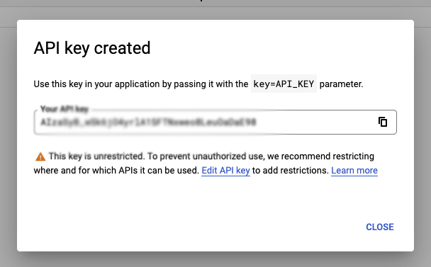

# Exercise 1: Sign up for accounts

For this lab we will need 2 accounts:

1. Camunda Platform 8 (C8) account
2. Google Cloud account

## Camunda Platform 8 (C8) account

  * [Sign up for an account](https://accounts.cloud.camunda.io/signup?utm_campaign=Trial.CamundaPlatform8.EN&utm_source=april_2022_workshop&utm_medium=referral&utm_term=DavidSimmons). This is a free trial account which will give you 30-days to try out Camunda Platform 8. You can use this account to create and deploy processes.

You will then fill out the form to create your account:

Once you've signed up, you will be sent a confirmation email with a link to activate your account. Clicking on the link in that email will take you to the login screen where you will enter the email address and password you created in the first step.

Once logged in, you will see your Console page. This is where you will see your account information and the processes you have deployed. So far, you won't have any clusters or processes, so let's go ahead and create one.

Under the Clusters area, you will see that you have 0 Clusters, and a link to `View All` which will take you to the page where you can create a new cluster. Click on the `Create New Cluster` button. You can name your cluster whatever you want, but it should be unique.

Finally, click on the `Create` button. You should be directed back to the Clusters page where you will see your cluster being created.

This process can take several minutes as the cluster is provisioned in the cloud and the cluster is configured and started.

If you click on the cluster while it is being created, you will see more details about the cluster, and you will be able to create the Client Credentials that you will need to connect to the cluster.

You should click on the `API` tab, and then click the `Create` button in order to create your credentials. You can name your credentials whatever you want, but it should be unique.

You will then be presented with a screen listing your credentials. Click the `Download Credentials` button to save the credentials to your computer.

**Important:** You will need these credentials for the rest of the exercises, and you will _not_ be able to see your `Client Secret` again after you download them.

You can view the rest of your credentials in the `View` tab, but your `CLient Secret` will not be visible.

Once your credentials are created and your cluster has finished being provisioned, your Console page will show you the cluster you created, along with links to the Modeler, the Task List, Operate (where running tasks are shown), and Optimize where you can create reports, etc. for your cluster.

At this point your cluster is ready to use!

## Google Cloud account

Later on in this lab we will be using the Google Image AI service to process images. In order to use the service, you will need to create a Google Cloud account. If you already have a google account, you can use that account.

You can login to your Google account, and then go to the [Cloud Console](https://console.cloud.google.com/) where you can create a new project.

Once your project is created, go to the `Getting Started` box and click the `explore and enable APIs` link.

Under the `APIs and Services` menu you will see the `Libraries` link, which you should click on.

Click on `Libraries` and look for the `Google Cloud Vision API` link.

Once you've selected that, you can click the `Enable` button to enable this API.

You can now click on the `Credentials` link on the left side, and then click the `Create credentials` button at the top of the page. Choose the `API key` option and your API Key will be shown. Save this API Key somewhere safe.

**Important:** You will need this API Key later on, and it's easier to save it now than it is to try to retrieve it later!

## Accounts Created

You've now created all the accounts and credentials you will need to complete the  lab!

[Exercise 2](../Exercise2/index.md)