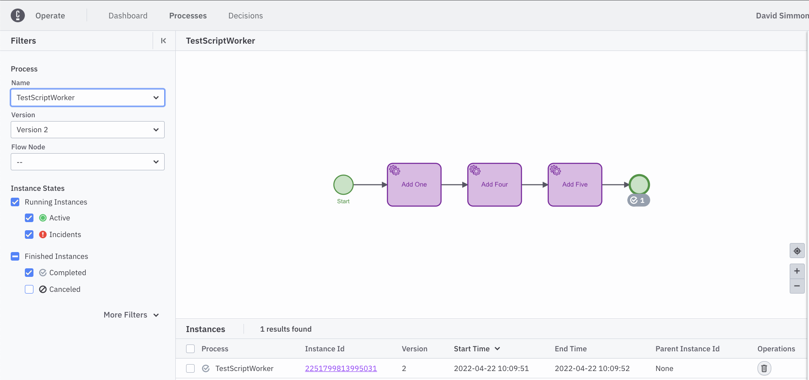
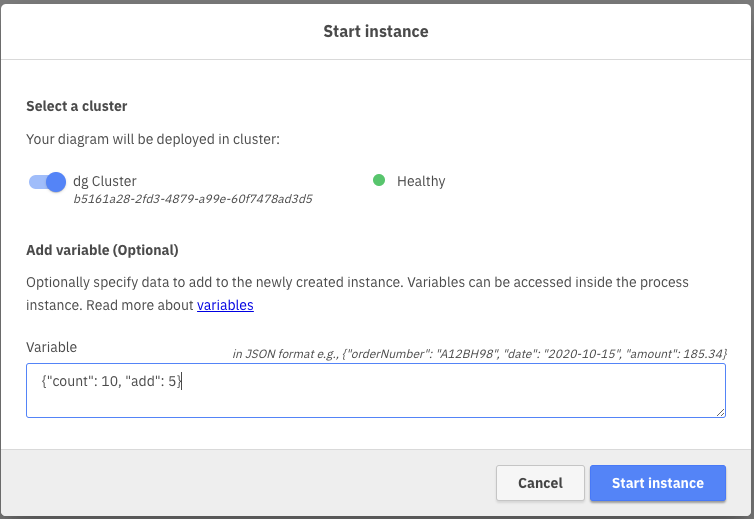
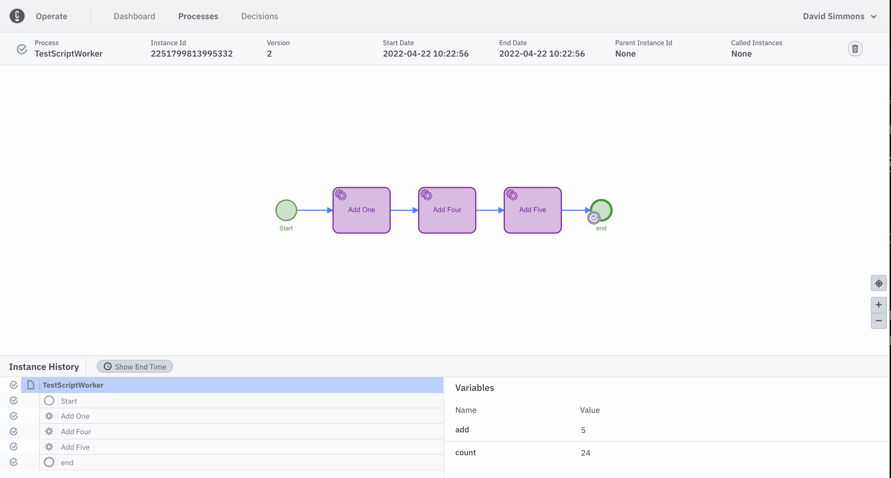

# Exercise 2: Your first process

## Implementing a simple script worker in Golang

In Camunda Platform 7 one could choose to implement scripts 'in line' in the process definition. While this was not a 'best practice' and was discouraged for maintainability, it was still a simple option for small problems.

In the original version of the CandyCam project, I used in-line scripts to add Candy to the process at various times.

With Camunda Platform 8 SaaS there were no longer any options for inline scripts. Frankly, that's a good thing in my opinion. But it does mean that you hav eto find a new way to handle these relatively simple tasks. In this workshop we will implement a simple script worker in Golang.

The `main.go` file is the solution here. It will start a task worker and listen for tasks. When a task is received, it will execute the script and then complete the task. The task listener looks for 2 variables in the incoming job: `count` and `add`. If the `count` variable is missing, it will default to initializing it at 0. If the `add` variable is missing, it will default to adding 1 to the `count` variable.

## Setup

In order to communicate with the Camunda Platform 8 (C8) service, we need to initialize all of the required variables like `ClientID`, `ClientSecret`, etc. In order to do this you can either set environment variables or fill out the `zeebe.yaml` file to hold the values:

```yaml
zeebeAddress: 'YOUR_SERVER_ADDRESS.bru-2.zeebe.camunda.io:443'
zeebeClientID: 'YOUR_CLIENT_ID'
zeebeClientSecret: 'YOUR_CLIENT_SECRET'
zeebeAuthServer: 'https://login.cloud.camunda.io/oauth/token'
```

We will use this file throughout this workshop, so I suggest putting it at the top-level of your project.

The `script-worker` process will read this file in and set all the variables as needed to communicate with the C8 processes.

The only edit to the file that is required is to change the `PROC_NAME` constant to the name of your process. Once this is set you can start the `script-worker` with the following commands:

```bash
$ go build
$ ./script-worker
```

You should see output like this:

```shell
Starting Camunda Cloud Zeebe ScriptWorker
===================================
handleC8Job
{Add:0 Count:0}
{Add:1 Count:1}
Complete job 4503599627617096 of type AddOneTask
...
```

If you'd prefer to run all of these commands from a single terminal you can background the task with the following command:

```bash
$ ./ScriptWorker &
```

If you'd like to turn off all of the output to the terminal, change the line

```go
const DEBUG = true
```

to:

```go
const DEBUG = false
```

before building the ScriptWorker.

## Testing your Script Worker

To make sure that your script worker is working correctly, let's run a few tests.

First, we will need to create and deploy a process that will call your script worker task.

in the `main.go` file set the `PROC_NAME` constant to `AddOneTask`, build and start your ScriptWorker.

There is a file `test-script-worker.bpmn` in this directory that you can use to create a test process. You can drag-drop this file into the Modeler tab of Camunda Cloud. Your propcess should look like this:


You can click the `Deploy Diagram` button to deploy the process. Once the process is deployed, click the `Start Instance` button to start a process instance.

If you've made no changes to the process diagram, your process should complete very quickly. You can go to the `Operate` tab and see a list of processes that are running (or finished).



If you click on the process ID in the list, you can see that the process has completed, and that the total count at the end is `10`. (We started it with `count=0` and added `add=1` to it, then added `4`, then added `5`.)

Alternatively, we could start the process with an arbitrary number, and add any number to it in the first step. To do this, we add a starting set of variables to the process:

```json
{
  "count": 10,
  "add": 5
}
```



And we will end up with a final count of `24` (10 + 5 + 4 + 5 = 24).



We will be using this simple ScriptWorker for other parts of this lab.

Time to move on to [Exercise 3](../Exercise3/index.md).