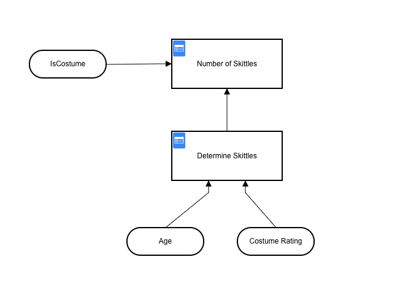
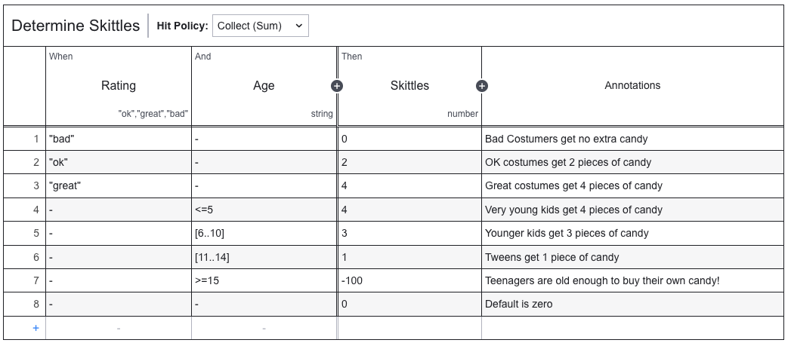

# Exercise 5: Using Decision Tables

As we saw in the previous exercise, doing everything manually in separate steps is tedious and time consuming. What if there were a way to automate more of the process so that we only had to interact with it once? This is where Decision Tables come in.

## Creating a Decision Table

Of course the Decision Table for this exercise is already created for you, but let's go through and look at it a little bit more in order to understand how it works.

This is a nested decision table. At the bottom are 2 inputs `Age` and `Costume Rating` that are used as input to the `Determine Skittles` Decision Table. At the top, there is an input `isCostume` as input to the `Number of Skittles` Decision Table.

The logic of this setup is that the first input, `isCostume` is used to make a decision in the upper table, and the `Age` and `Costume Rating` inputs are used to make a decision in the lower table.
 The outermost table is the decision table that will be used to decide what to do with the data. The innermost table is the decision table that will be used to decide what to do with the data after the outermost table has been used to decide what to do with the data.

Let's start out by looking at the lower table. This table is used to decide how many skittles to dispense.

This decision table is a `Collect (sum)` table which means that it will go through all the rules and add up all the values from the rules that apply. It will output the final sum from this table.

Since this table has 2 inputs, `age` and `costumeRating`, we will set up rules for each input. As the decision table is executed it will move from top to bottom applying each rule. You can see that a `great` costume (rule 3) for a child <= 5 years old (rule 4) will result in 8 skittles.

Now, let's look at the upper table. This table is used to decide if the picture is a costume or not, and then finally to decide if skittles should be dispensed.

This table uses a `first hit` policy to decide what to do. This means that it will stop looking at the rules once it finds one that applies. Since the first rule is `isCostume == false` it will stop looking at the rules and output `0` as the number of skittles if the picture does not contain a costume. If the number of Skittles is <0 it will output 0. Remember that the rule from the lower table says that if the age is >= 15 they get -100 Skittles, so this is the rule that would apply to that. If neither rule applies, it will simply pass the number of Skittles from the lower table as the result.

## Creating the Process

Now that we have the decision table, it's time to create the process and the form that we will use. Since our goal here is to simplify the process and require less human interaction we're going to combine everything into one form.

