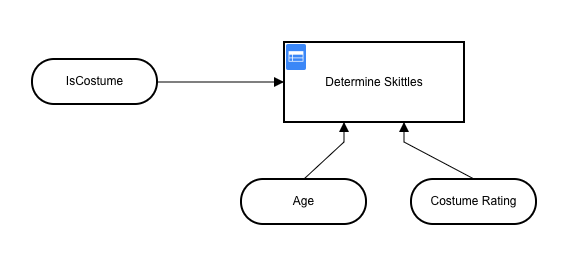
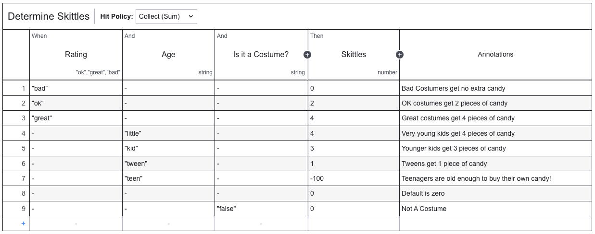
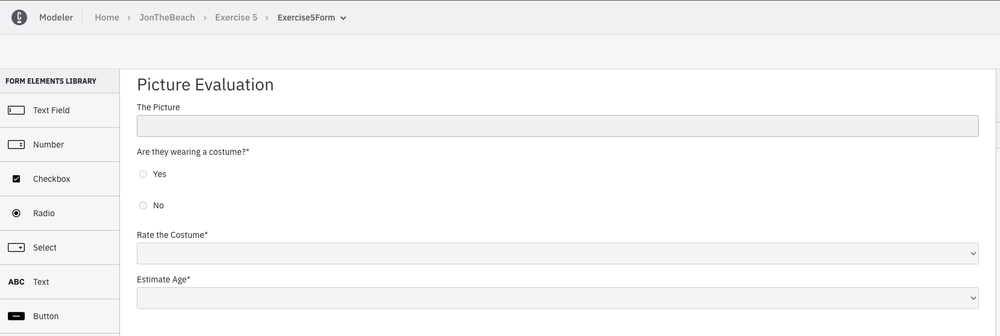
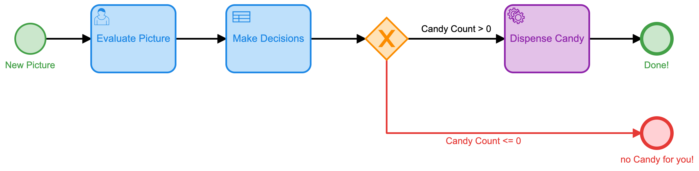
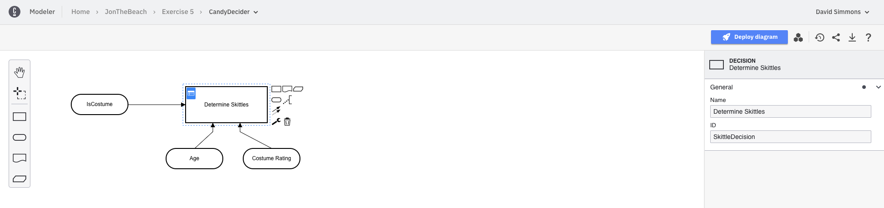

# Exercise 5: Using Decision Tables

As we saw in the previous exercise, doing everything manually in separate steps is tedious and time consuming. What if there were a way to automate more of the process so that we only had to interact with it once? This is where Decision Tables come in.

## Creating a Decision Table

Of course the Decision Table for this exercise is already created for you, but let's go through and look at it a little bit more in order to understand how it works.

This decision table takes 3 inputs `isCostume`, `Age`, and `Costume Rating` that are used as input to the `Determine Skittles` Decision Table. These are all the variable we need in order to make a determination of how many Skittles to dispense.

If we look at the details of how the decision is made, we can see how these inputs are used:

You can see that we first evaluate the rating of the costume and add Skittles (or not) based on that rating. We then evaluate the age of the person, and again add (or subtract) skittles from the total.

In the last step we evaluate the `isCostume` variable and if it is `false``, we zero out the total, because if you're not wearing a costume, you get no candy!

This decision table is a `Collect (sum)` table which means that it will go through all the rules and add up all the values from the rules that apply. It will output the final sum from this table. That's why we save the `isCostume` for last so that we can zero out the total as the last step.

## Creating the Form

Now that we have the decision table, it's time to create the form that we will use. Since our goal here is to simplify the process and require less human interaction we're going to combine everything into one form.

It really is just all the elements from the previous forms (from [Exercise 4](../Exercise4/index.md)). We're simply going to do all the evaluations in one form.

## Creating the Model

The model is a much more simplified version of what we did in [Exercise 4](../Exercise4/index.md). We're going to create a model that only one form and has one decision table.

**Note:** Finding the `decision id` for the decision table can be a bit tricky. You can find it by opening the Decision Table, and clickin on the table itself, then looking in the Properties Panel under the `General` tab.

## Running the process

Now that we have out decision table, our form, and our model, it's time to get it all up and running. First, you'll need to deploy the decision table. Open the decision table in the modeler, and click the `Deploy Diagram` button.

Once the Decision Table is deployed, you'll do the same thing with the form. Open the form in the modeler, and click the `Deploy Diagram` button.

Finally, you'll need to deploy the model. Open the model in the modeler, and click the `Deploy Diagram` button.

Now that all 3 parts of the process are deployed, you can start the process.

## Running the Process

The process ID (unless you changed it in the model) is `exercise-5-process`. If you hold down the second button on your camera board for about 10 seconds the board will reset itself and you can repeat the steps from [Exercise 3](../Exercise3/index.md) to configure the board to start the process.

- Enter the WiFi credentials
- Enter your Camunda Platform 8 API Keys from [Exercise 1](../Exercise1/index.md)
- Save the configuration
- Press the Picture button

If you go back to your Camunda Platform 8 Console now, and look under the Operate tab, you should see your Exercise 5 process running. You can then go to the Task Manager tab to complete the form and watch as the decision table is executed and skittles are dispensed up front.

## Conslusion

We have now seen how using a DMN Decision table can greatly simplify and streamline the entire process. We have reduced the human interaction to a single form, and we have a single DMN table to make all the decisions before dispensing Skittles.

In the next exercise we will see how we can remove all human interaction from the process and turn everything over to some Image AI technology to make all the decisions.

[Exercise 6: Using Google AI to automate decisions](../Exercise6/index.md)