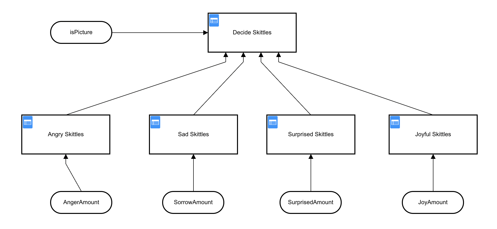
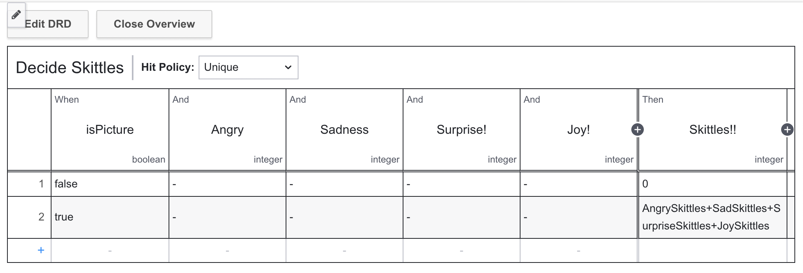

# Exercise 6: Using Google AI to automate decisions

## Humans are slow

As we've seen in the previous exercises, humans are slow. They take a long time to think about what they want to do, and they don't always get it right. Also, filling out the same form repeatedly is tedious and time consuming, and people get tired of doing the same thing over and over.

We saw that we can reduce some of this time by reducing the number of forms, but still, there is a form that requires human interaction.

In this final exercise we will see how we can automate an entire process by removing all human interaction and still achieving a result.

## What we will do

In order for this portion of the workshop to work, we are going to change the overall task a little bit. We could continue with the costume evaluation process, but in order to do so we would first have to train a Visual AI model to detect the things we're looking for, and that is well outside of the scope of this workshop.

If training an AI model is something you're interested in doing, please feel free to contribute that model to this github repo so that others can use it.

Since we don't have a trained AI model for costumes and ages, we're going to use a pre-trained Google Vision AI model to evaluate the emotional state of a person and dispense candy depending on their state.

## The New Process

Since we are no longer using any forms, or any user tasks, our process is going to be very short and relatively simple.


As you can see, we have one external task, followed by a decision table, followed by the task to dispense candy (if any candy is deserved, of course).

This is, clearly, a much simplified and more efficient process that requires no human interaction. We can deploy this process and have it run, unattended, for as long as we want.

## The Google AI Task

The first thing that happens when a picture is submitted is that we execute a "Submit to Google AI" external task. This task takes the provided picture, submits it to Google's Vision AI API, and returns the evaluated results to the model.

To do this, we will submit the picture to Google's Vision AI API. This is why we all enabled that API in our Google Console back in Exercise 1!

If you're not interested in how this whole process works, you can simply build and start the `exercise-6.go` task worker as is.

Much of the Golang code in this Task Worker will look vary familiar from previous exercises. We start a Task Worker using our Camunda Platform 8 credentials, which listens for tasks with the ID `DoPictureAI`. When it finds one, it gets the process variable `imageLoc`, downloads the picture at that location, and submits it to the Google Vision AI for processing.

```go
jobKey := job.GetKey()
	_, err := job.GetCustomHeadersAsMap()
	if err != nil {
		// failed to handle job as we require the custom job headers
		failJob(client, job)
		return
	}
	jobVars := JobVars{}
	err = job.GetVariablesAs(&jobVars)
	if err != nil {
		failJob(client, job)
		return
	}
	dPrintf("%+v\n", jobVars)
	if jobVars.ImageLoc == "" {
		failJob(client, job)
		return
	}
	// Get the image from the storage
	resp, err := http.Get(jobVars.ImageLoc)
	if err != nil {
		failJob(client, job)
		return
	}
	defer resp.Body.Close()
  emote := doAIOnPic(&resp.Body)
  ```

That last bit is where the actual work takes place, so let's look a little more closely at that.

```go
  client, err := vision.NewImageAnnotatorClient(ctx, options)
	if err != nil {
		log.Fatalf("Failed to create client: %v", err)
	}
	defer client.Close()
	im, err := vision.NewImageFromReader(io.Reader(*image))
	if err != nil {
		log.Fatalf("Failed to create image: %v", err)
	}
	emotions := Emotions{}
  annotations, err := client.DetectFaces(ctx, im, nil, 10)
	if err != nil {
		fmt.Println("No faces found.")
		emotions.IsPicture = false
		log.Fatalf("Failed to detect faces: %v", err)
	}
```

We first create a Google Vision API `client` which we will use to submit the image, once we have that, we will create the new image from the URL we got as part of the process variables. This actually saves us some memory because we don't download the image, and then submit it but rather send a reference to the `Reader` object directly to the Google Vision API `NewImageFromReader` method. We also create a `emotions` variable to store the results of the Google Vision API.

When we submit the image to Google, we will get back an `annotations` object from Google. We are not interested in everything in this object, so I created an `interestingAnnotations` JSON object that has the parameters we will use to dispense candy:

```go
type interestingAnnotations struct {
	DetectionConfidence    float64 `json:"detection_confidence"`
	LandmarkingConfidence  float64 `json:"landmarking_confidence"`
	JoyLikelihood          int     `json:"joy_likelihood"`
	SorrowLikelihood       int     `json:"sorrow_likelihood"`
	AngerLikelihood        int     `json:"anger_likelihood"`
	SurpriseLikelihood     int     `json:"surprise_likelihood"`
	UnderExposedLikelihood int     `json:"under_exposed_likelihood"`
	BlurredLikelihood      int     `json:"blurred_likelihood"`
	HeadwearLikelihood     int     `json:"headwear_likelihood"`
}
```

We can then go through the larger `annotations` object and gather the things we want:

```go
  for i, annotation := range annotations {
		goodStuff := interestingAnnotations{}
		data, err := json.Marshal(annotation)
		if err != nil {
			log.Fatal(err)
		}
		err = json.Unmarshal(data, &goodStuff)
		if err != nil {
			log.Fatal(err)
		}
		dPrintln("  Face", i)
		emotions.Anger = annotation.AngerLikelihood.String()
		emotions.AngerNumber = goodStuff.AngerLikelihood
		dPrintln("    Anger:", annotation.AngerLikelihood)
		emotions.Joy = annotation.JoyLikelihood.String()
		emotions.JoyNumber = goodStuff.JoyLikelihood
		dPrintln("    Joy:", annotation.JoyLikelihood)
		emotions.Surprise = annotation.SurpriseLikelihood.String()
		emotions.SurpriseNumber = goodStuff.SurpriseLikelihood
		dPrintln("    Surprise:", annotation.SurpriseLikelihood)
		emotions.Sorrow = annotation.SorrowLikelihood.String()
		emotions.SorrowNumber = goodStuff.SorrowLikelihood
		dPrintln("    Sorrow:", annotation.SorrowLikelihood)
	}
```

We will then return this `emotions` object, from which we will submit the task variables:

```go
  variables := make(map[string]interface{})
	variables["isPicture"] = emote.IsPicture
	variables["Joy"] = emote.Joy
	variables["JoyNumber"] = emote.JoyNumber
	variables["Anger"] = emote.Anger
	variables["AngerNumber"] = emote.AngerNumber
	variables["Surprise"] = emote.Surprise
	variables["SurpriseNumber"] = emote.SurpriseNumber
	variables["Sorrow"] = emote.Sorrow
	variables["SorrowNumber"] = emote.SorrowNumber
	dPrintf("%+v\n", variables)
	request, err := client.NewCompleteJobCommand().JobKey(jobKey).VariablesFromMap(variables)
	if err != nil {
		failJob(client, job)
		return
	}
	dPrintln("Complete job", jobKey, "of type", job.Type)
	ctx := context.Background()
	_, err = request.Send(ctx)
	if err != nil {
		panic(err)
	}
```

I'm returning the `String` values, but when we look at the DMN table you will see that they are unused. We could use them in the process if we wanted to, but for this exercise we will just use the `Number` values.

## Making Decisions

Now that we are using a different criteria for our decision, we need to create an entirely new decision table in order to decide how much candy to distribute.



Woah! That's a complicated table! In fact, it's not just one table but a whole series of them, all feeding into one final table that will decide how much candy to distribute.

**Note:** the smaller tables contain my proprietary algorithm for giving out candy based on the detected `mood` of the person in the picture but you are welcome to create your own by modifying those tables however you wish.

You can see from the table for `Joy` how I calculate the number of pieces of candy for someone:


These calculations are entirely made up by me.

Once the number of pieces of candy are calculated for each emotion, the final table adds them all up and provides a final result:



