# Assembly and Configuration of the Hardware

In this portion of the lab we will assemble the hardware components in the kit and, once build, we will configure the hardware to use in our process.

## Building the hardware

  It's time to assemble the hardware for the lab, finally! Here's what the entire contents of the kit look like:

  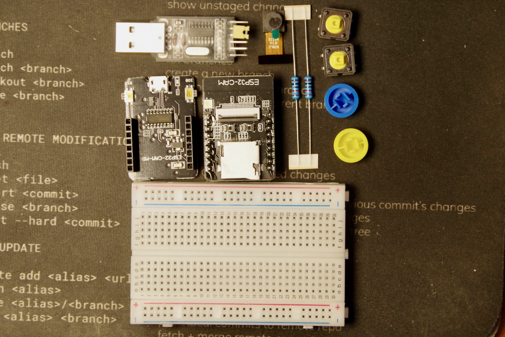

  If you're missing any pieces, please let me know. What you should have is:
    - 1 ESP32-Cam Board
    - 1 camera module
    - 1 programmer board
    - 1 breadboard
    - 2 10k ohm resistors
    - 2 tactile buttons (with colored covers)
    - 1 USB to TTL adapter
    - 11 jumper wires

  First, you'll need to open the little black clamp on the top of the ESP32-CAM

  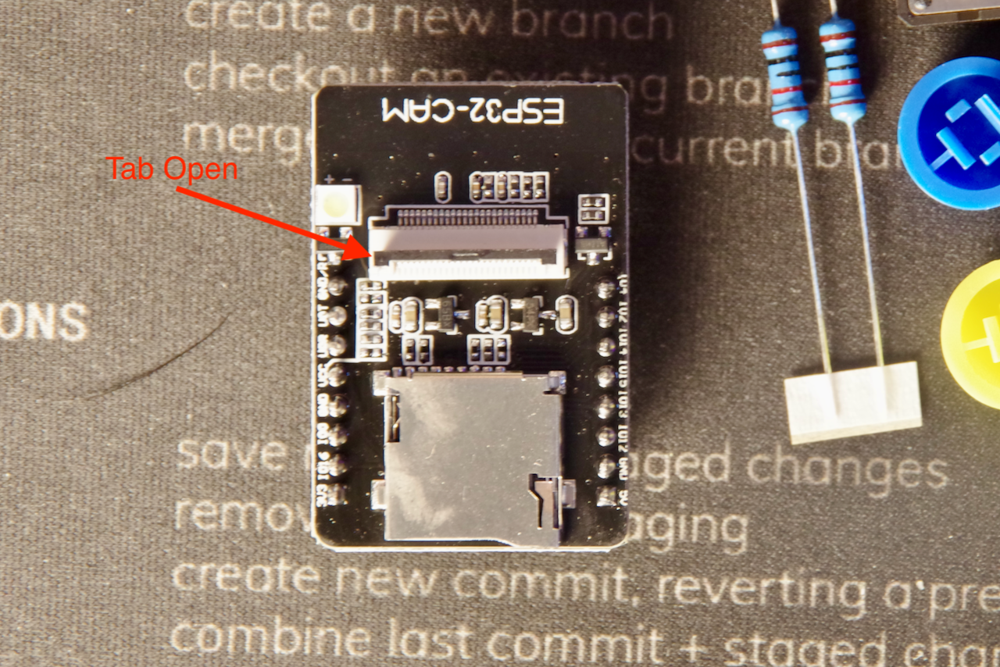

  Insert the camera ribbon cable into the clamp and close the black tab completely.

  **Note:** This is a delicate piece of plastic, so be very careful with it. Do not force it. If you do, you'll damage the camera module.

  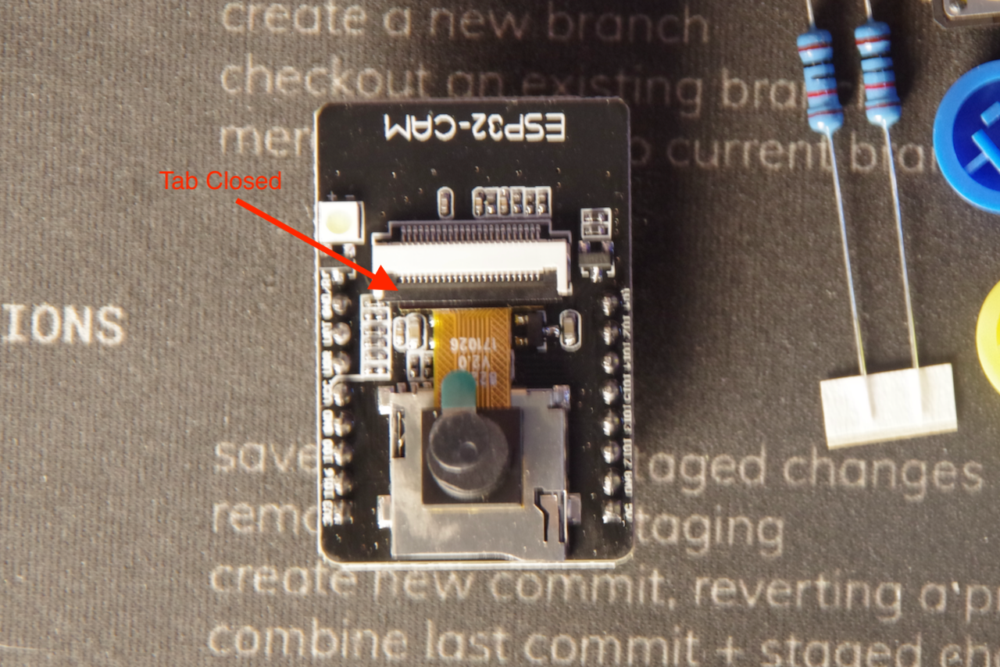

  Now you can place the ESP32-CAM board on the breadboard. Put the module at one end of the breadboard, as far as it will go, with the antennae hanging off of the end of the breadboard.

  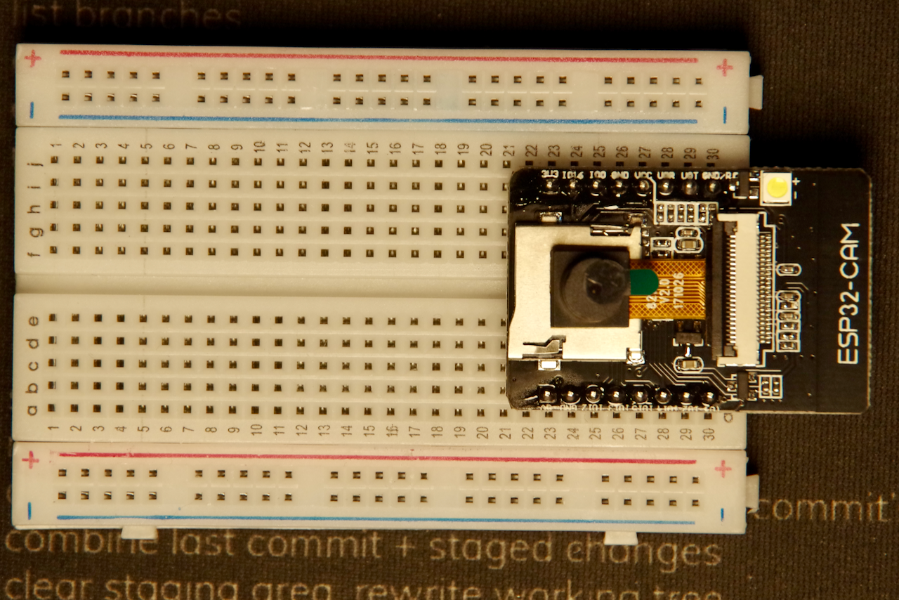

  Next, place the 2 tactile buttons on the breadboard near the opposite ends. The buttons should straddle the center of the breadboard.

  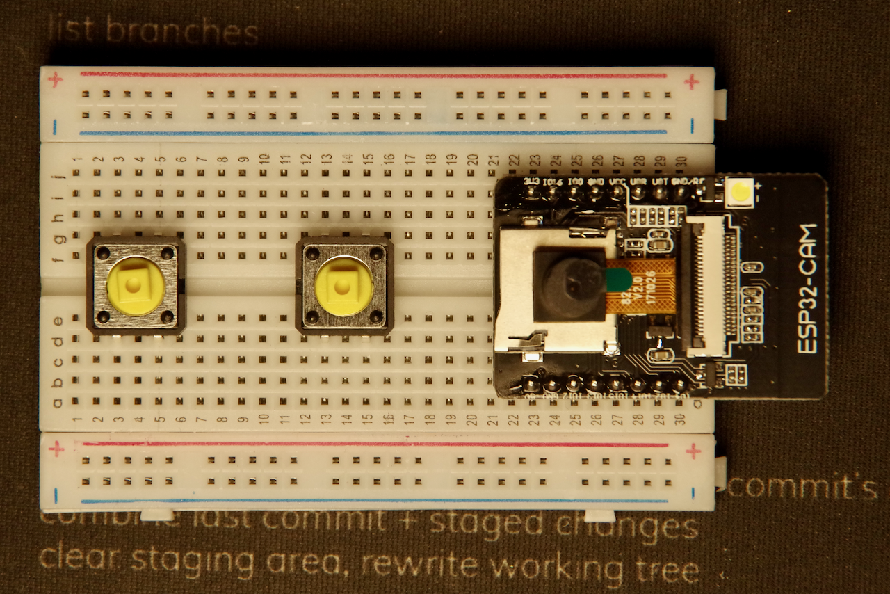

  Next, bend the 2 ends of the 10k ohm resistors to 90º angles and insert them into the breadboard. One end should be in the same row as the leg of the switch nearest the camera module. The other end should go into the outside row of the breadboard marked **(-)**.

  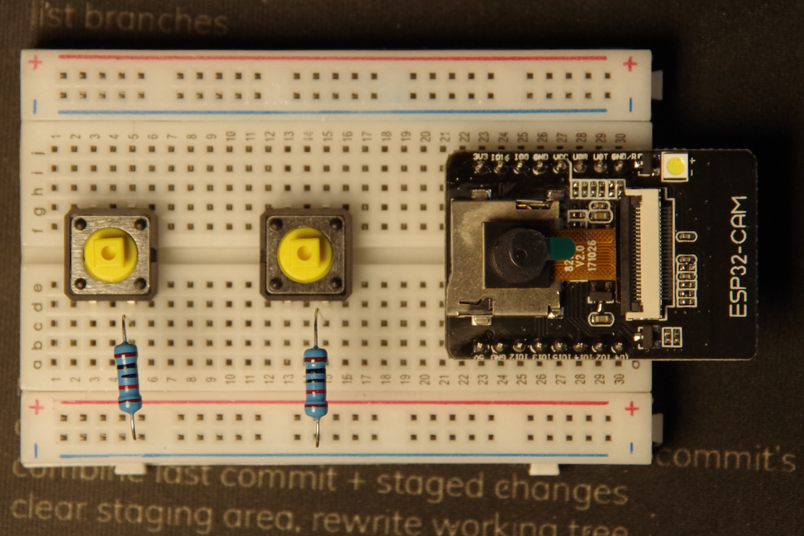

  Now get one pair of jumper wires and connect them to the tactile buttons. The wires should go into the row of the switch leg opposite from the 10k ohm resistor. The other ends of the wires should go into the rows next to pins `IO12` and `IO13` on the ESP32-CAM board.

  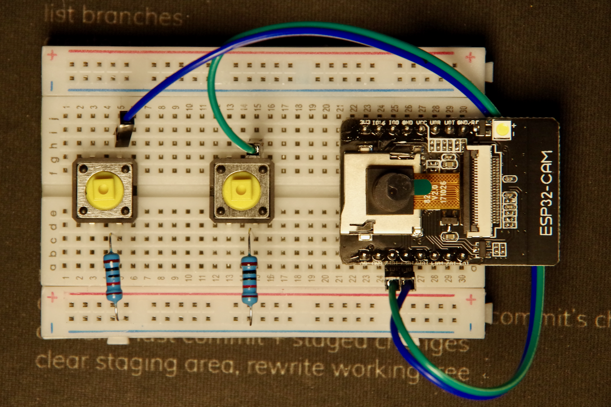

  Now connect 2 more jumper wires from the other leg of the tactile switch near the 10k ohm resistors to the row marked **(+)** on the side of the breadboard.

  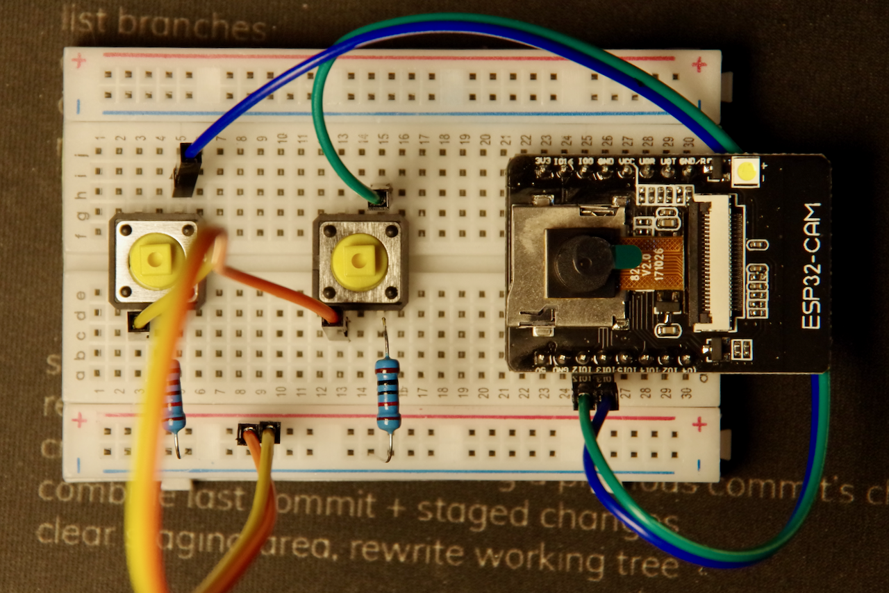

  Next, use 2 more jumper wires to connect the `5v` and `GND` pins on the ESP32-CAM board to the rows marked **(+)** on the side of the breadboard.

  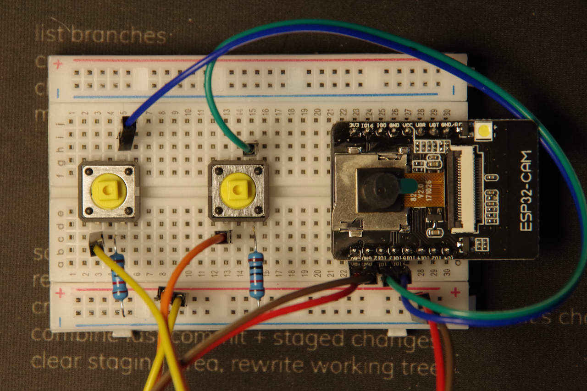

  Get out the USB to TTL adapter and remove the jumper clip from it.

  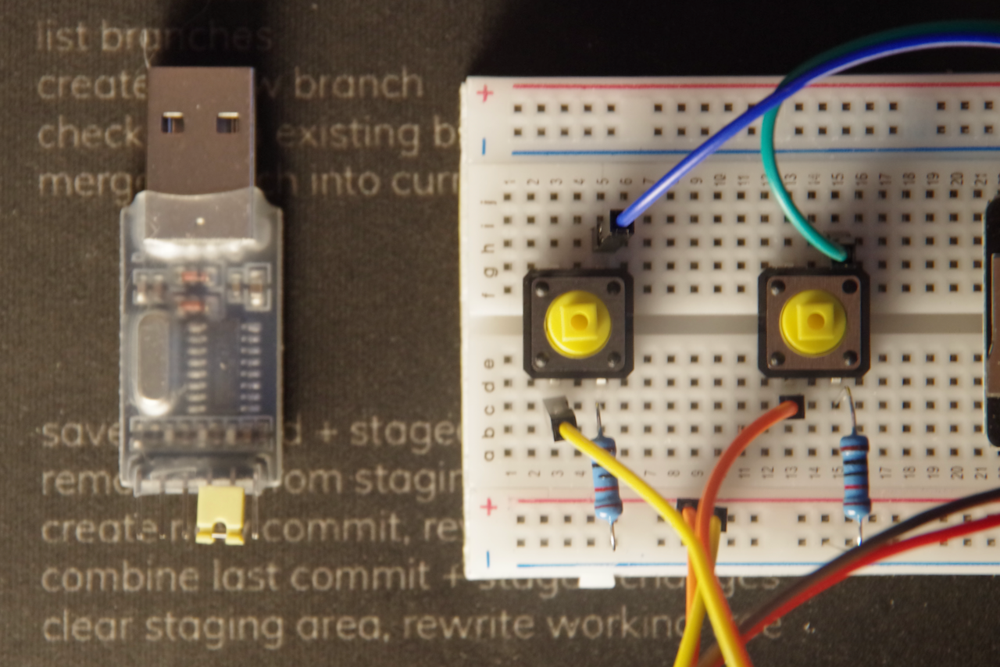

  Connect one set of jumper wires to the `5v` and `GND` pins on the USB to TTL adapter and another set of jumper wires to the ``TXD` and `RXD` pins.

  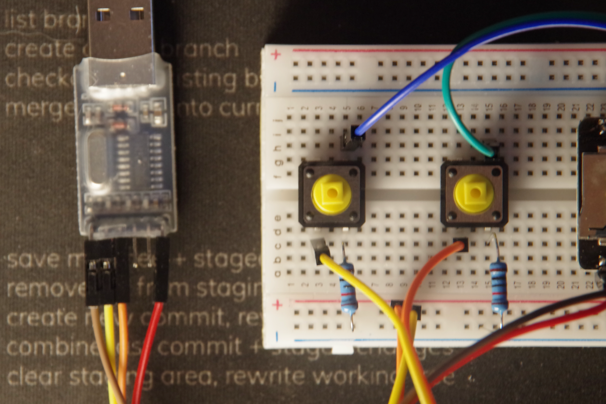

  Connect the jumper wires from the `5v` and `GND` pins on the ESP32-CAM board to the rows marked **(-)** on the side of the breadboard.

  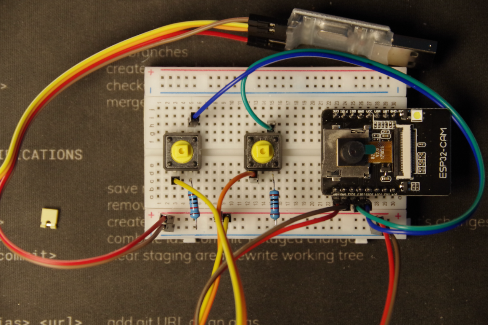

  Finally connect the jumper wires from the `TXD` and `RXD` pins on the USB to TTL adapter to the `RX` and `TX` pins on the ESP32-CAM board.

  **Note:** Remember that the `TXD` pin on the USB-TTL adapter connects to the `RX` pin on the ESP32-CAM board and the `RXD` pin on the USB-TTL adapter connects to the `TX` pin on the ESP32-CAM board.

  You can now add the colored button covers to your tactile buttons to complete the hardware.

  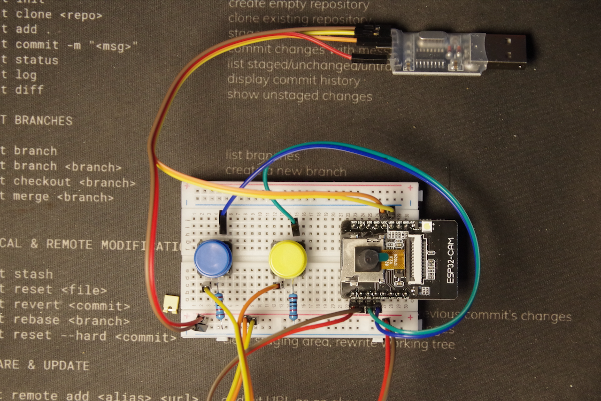

  Your IoT Hardware build is now complete!

  ## Configuring the hardware

  Now that you've assembled the hardware, you'll need to configure it to use in your process.

  We will need to connect it to WiFi and set the C8 process variables so that our camera can connect to our process and start jobs.

  This is a fairly easy process thanks to the `WiFiManager` library that we will be using.

  The first step is to open the Arduino IDE and open the [CandyCam](CandyCam/CandyCam.ino) sketch.

  You may need to install the following Libraries:
    - WiFiManager

  We wil also need to install the proper board support package for the ESP32-CAM board. For this exercise we will be using [ESP32 Arduino 2.0.3-RC1](https://github.com/espressif/arduino-esp32/releases) which is the most recent release.

  To install this release, go to the Ardunio IDE and open the `Preferences` menu.

  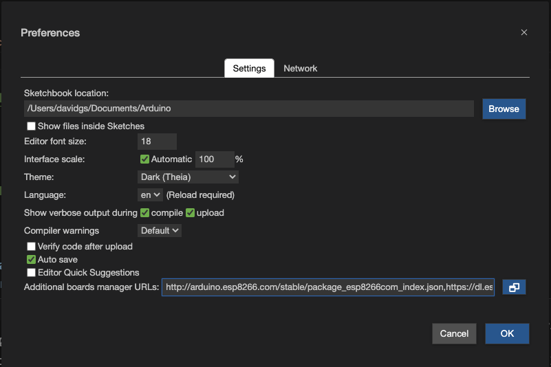

  In the `Additional Board Managers URL` field past the following: https://raw.githubusercontent.com/espressif/arduino-esp32/gh-pages/package_esp32_dev_index.json and click `OK`.

  Next, go to the `Boards Manager` menu and search for `ESP32`. You should see the option to install `esp32 by espressif systems` and the version should be `2.0.3-RC1`. Click `Install`.

  Now it's time to install the required libraries. These are all included in the `Libraries` directory as `zip` files so you can go to the Arduino IDE and open the `Libraries` menu and click `Install Library from Zip`.

  - WiFiManager
  - ArduinoJson
  - Ticker
  - WiFiClientSecure

Once all of these libraries are installed, you can open the `CandyCam` sketch. All you should need to do at this point is plug your ESP32-CAM into the USB port on your laptop and click `upload` to load the sketch to your device.

Once the upload is complete, open the Serial Monitor and look for the line:

```
*wm:[1] StartAP with SSID:  ESP32_48BD9E7C
```

You're looking for that `SSID` specifically. You should now be able to go to your WiFi network and connect to that SSID. Once connected, look for the IP address you've been assigned, which should be something like `192.168.4.2`. Point your web browser at the Gateway Address for that IP address (it will be the same address, but ending in `1`, so in the above example it should be `192.168.4.1`).

You should be greeted with the Welcome page:

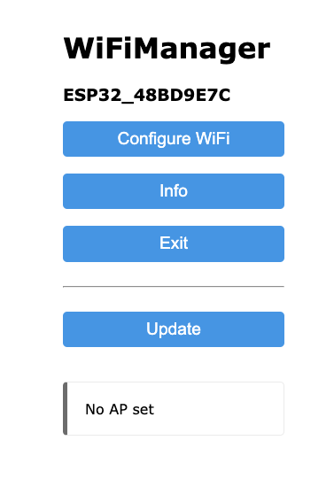

Click on `Configure WiFi` and you will see the configuration page:

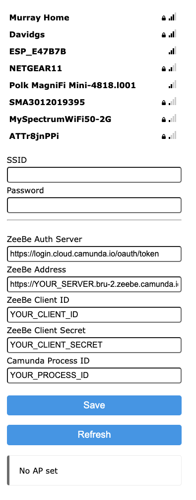

  - `SSID`: The name of the WiFi network you are connecting to.
  - `Password`: The password for the WiFi network you are connecting to.
  - `ZeeBe Auth Server`: This should not need to be changed.
  - `ZeeBe Address`: The address of your C8 Cluster.
  - `ZeeBe Client ID`: The client ID for your C8 Cluster.
  - `ZeeBe Client Secret`: The client secret for your C8 Cluster.
  - `Camunda Process ID`: The Process ID of your process.

We will be using this configuration page a few times, so having your C8 Cluster information handy is a good idea. You can always get back to this configuration page by holding down the first button on your board and waiting for the board to reset and give you the SSID again in the Serial Monitor.

Your ESP32-CAM should now be connected to the WiFi Network and be ready to submit pictures to the process (don't press the button just yet, since you don't have a process yet).